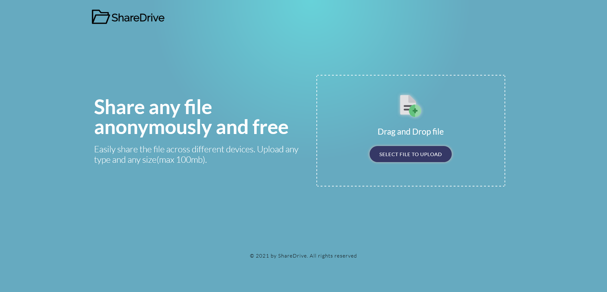

# ShareDrive 📁

> ShareDrive is a file sharing service that allows users to share file with other users. You can easily share file with your friends and colleagues, the link expires after a certain time.

## [Demo](https://sharedrive-123.herokuapp.com/)



## Features

- [✔️] File sharing
- [✔️] File sharing link expiration

## Getting Started

Clone the repository, and run the following command inside the project directory to install all the dependencies:

```
npm install
```

Create an environment file to run the application, as per the `env.example`.

To start the application run the following command:

```
npm start
```
